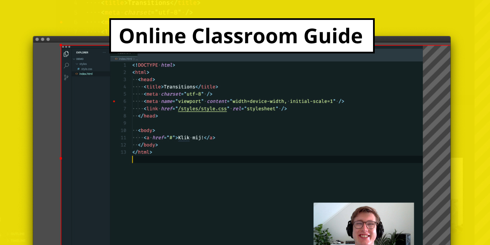

# online-classroom

> 📖 A (technical) guide on how to virtual classroom

## Description

These are technical guides on how to set-up software and hardware to create a _online classroom_ experience for students. It also explores some ways on how to make your _screencasts_ more professional.

The guides mainly focus on technical courses, since we write about setting up your code editor for example but most principles can be applied to non-technical courses.

All the supporting material used for writing these guides can be found in [`resources.md`](/resources.md).

## Guides

- [Set-up your code editor](guides/editor.md)
- [Collaborate with students](/guides/share.md)
- [Virtual Classroom](/guides/classroom.md)
- [Creating screencasts](/guides/screencasts.md)
- [Equipment and gear](/guides/gear.md)
- [Workspace inspiration](/guides/workspace.md)
- [Additional Resources](/resources.md)

## Program

This guide was written for [Communication and Multimedia Design][bachelor], a
design bachelor focused on interactive digital products and services. CMD is
part of the [Faculty of Digital Media and Creative Industries][faculty] at the
[Amsterdam University of Applied Sciences][university].

Original work [MIT](license) © [Danny de Vries](https://www.github.com/dandevri), created for [AUAS](https://www.amsterdamuas.com/).

[bachelor]: https://www.cmd-amsterdam.nl/english/
[faculty]: https://www.amsterdamuas.com/faculty/fdmci/faculty-of-digital-media-and-creative-industries.html
[university]: https://www.amsterdamuas.com
