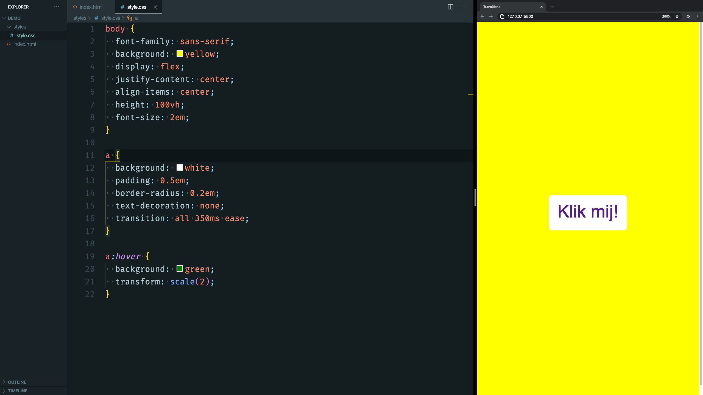

# Editor Settings



> This guide focusses on Visual Studio Code as your editor of choice. The tech-expertise working group decided this is going to be our main editor for the upcoming years.

When making screencasts or doing live demo's you'll probably want to change some of your VS Code settings to increase the font size, make the colors easy to see on a projector screen and removing 'noise' (things that distracts students) all together. Most of these things (extensions, pop-ups) are useful for writing code on your own but bet in the way when teaching.

## Workspaces

VScode has a _workspace_ feature where you can change your VS Code's editor, user interface, and functional behavior when you open specific folders or files.

→ [User and Workspace Settings](https://code.visualstudio.com/docs/getstarted/settings)

For example; you can set-up a 'NAME-OF-COURSE' folder with code examples and create a workspace for that folder. Then your 'teaching' settings will automatically apply if you are working in that specific folder.

If you want to go even further, you can also disable extensions if you open specific folders using something that Andy Van Slaars calls 'code profiles'.

→ ["Profiles" for VS Code](https://github.com/avanslaars/code-profiles)

## Hiding UI elements

There are a couple of UI elements that you might want to hide. You can add these lines to your `settings.json`.

**Disable Editor Minimap**

```
"editor.minimap.enabled": false,
```

**Hide the Activity Bar**

```
"workbench.activityBar.visible": false,
```

_You can also show or hide specific tabs in the activity bar if you don't want to hide the whole activity bar. Just right click and select which ones you want to hide or show._

**Disable suggestions and hints**

```
"editor.quickSuggestions": false,
"editor.suggestOnTriggerCharacters": false,
"editor.wordBasedSuggestions": false,
"editor.quickSuggestionsDelay": 1000000,
"editor.parameterHints.enabled": false
```

> If you don't want to set these settings, all of the main panels can also be show/hide under `view > appearence`. You can also use the `command palette` to toggle them e.g. search for `toggle status bar`.

If you really want to go _full minimal_ you can also enable `zen mode` but I find it too rigorous. I only enable it when I'm writing markdown.

**Other UI settings**

```
"editor.cursorWidth": 3,
"breadcrumbs.enabled": true,
"explorer.confirmDelete": false,
"workbench.editor.enablePreview": false,
"workbench.editor.enablePreviewFromQuickOpen": false,
"workbench.startupEditor": "newUntitledFile",
"editor.wordWrap": "on",
```

## Theme

### Font

A font-size between 18/21 usually works well. I think you can't go to big so I usually stick to `21`. I try to use a monospaced font that's _neutral_ so is quite legible (no condensed characters, no ligatures). _Fira Code_ is still my main choice.

```
"editor.fontSize": 21,
"terminal.integrated.fontSize": 21,
"markdown.preview.fontSize": 21,
```

### Zoom Level

Apart from the font-size you should also increase the zoom level of all the other UI in VS Code. You can hit `cmd/+` or `cmd/-` to change it on the fly. You can also set the default in your settings. I think a zoom level of `2` is the sweet pot.

```
"window.zoomLevel": 2,
```

### Color theme

Usually a light theme is the better option, most projectors will handle light background better then dark backgrounds. But personally, I really don't like the syntax theme's that come with light themes.

If your going for a dark color theme, try to pick a 'high contrast' variant which increases the differences between panels. I think the `Material Theme High Contrast` is a very good 'neutral' theme that has a great default syntax theme but still ads a bit of personality and customization over the VScode default themes. I do have a couple of custom settings:

```
"workbench.colorCustomizations": {
    "[Community Material Theme High Contrast]": {
      "editor.wordHighlightBackground": "#1f2d30",
      "editor.wordHighlightBorder": "#1f2d30",
      "editor.wordHighlightStrongBackground": "#1f2d30",
      "editor.wordHighlightStrongBorder": "#1f2d30",
      "editorBracketMatch.border": "#1f2d30",
      "editorBracketMatch.background": "#1f2d30",
      "scrollbarSlider.background": "#ffffff22",
      "editorOverviewRuler.bracketMatchForeground": "#0000",
      "editorOverviewRuler.errorForeground": "#0000",
      "editorOverviewRuler.warningForeground": "#0000",
      "editorOverviewRuler.infoForeground": "#0000",
      "editor.background": "#141e20"
    }
  },
```

## Terminal Settings

Try to use the VSCode integrated terminal to avoid switching to different screens.

**Change block to line**

```
"terminal.integrated.cursorStyle": "line",
```

### Prompt

Use a minimal prompt to reduce distractions. You can go into your `~/.zshrc` file and a minimal prompt:

```
export PROMPT='%n@%m %~ $ '
```

> You can also set this prompt to only be used in VS Code without affecting other terminal applications. See [this guide](https://howtoegghead.com/instructor/screencasting/terminal/) on egghead.

Remember that the default MacOS shell is zsh instead of bash since Catalina. So `PS1` prompts won't really work.

But even you are looking for more functionality (and a splah of color) I would install the default `spaceship prompt`.

```
npm install -g spaceship-prompt
```
