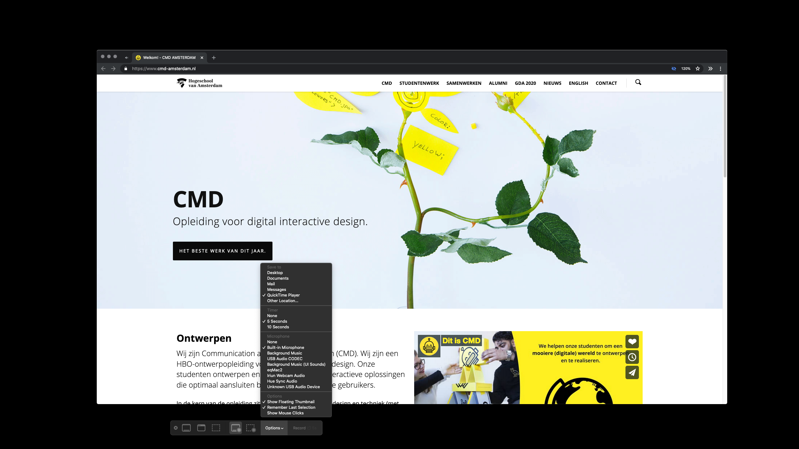
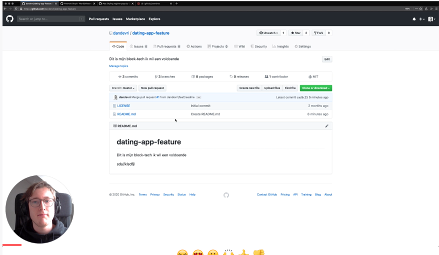

# Creating Screencasts

- [Creating Screencasts](#creating-screencasts)
  - [Tips](#tips)
  - [Camera](#camera)
    - [Smartphone Camera](#smartphone-camera)
    - [DSLR](#dslr)
  - [Software](#software)
    - [Quicktime](#quicktime)
    - [Loom](#loom)
    - [Screenflow](#screenflow)
  - [Hosting](#hosting)
    - [Brightspace](#brightspace)
    - [Third-party](#third-party)
    - [DIY](#diy)

There is a lot of work that goes into creating high-quality learning materials. Screencasting takes considerable effort. It's a learned skill that is particularly difficult if you are just learning how to do it. Share knowledge is a skill that you will be able to tap for the rest of your life.

## Tips

Most of these tips come from the Egghead guide on ['how to screencast'](https://howtoegghead.com/).

- Use a high contrast and colorblind friendly theme in text editors and design software.
- Guide the viewer’s eyes with the mouse.
- Dive right in, you don't want a whole backstory, slide deck etc. tutorials are concise, efficient information.
- Show, don’t tell. Lead by examples.
- If your example is airtight, it will do the instructing for you. Your narration will just serve to support it.
- looking at the same problem through multiple angles helps everyone learn better.
- Show first, then explain. Sometimes simply showing is enough.
- Remove distractions; Any extra information on the screen will easily distract the audience from the purpose of your lesson. Do your best to remove any extra notifications, UI, or other information that would take away from what you're teaching.
- No “hi, my name is.” No “in the previous lesson we learned about...” Each lesson should exist on its own without any stage-setting.
- If you’d rather sound more conversational, less scripted, write out an outline. We’re talking bullet points—the keywords you want to say, the points you want to hit.
- Allow some padding for the top and bottom of the recording window, which could get cut off by Player Chrome. For instance, if you're recording the terminal, commands toward the bottom might not be visible. You don’t want to frustrate or distract your viewers.

> These tips are also in [video format](https://egghead.io/courses/record-badass-screencasts-for-egghead-io) thanks to Egghead.

## Camera

### Smartphone Camera

The camera on your iPhone or iPad is leagues ahead of any webcam on the market. You should try to use your iPhone wherever you can. There are tons of tools to use you smartphone camera as a webcam, like [Camo](https://reincubate.com/camo/), [OBS camera](https://obs.camera/) or [Iriun](https://iriun.com/).

### DSLR

If you want to go even fancier and you have a DSLR camera you can also use that as a webcam. Canon released their [EOS Webcam utility](https://www.theverge.com/2020/4/29/21241305/canon-cameras-dslr-eos-webcam-utility-released) and at CMD Amsterdam we have a few [Elgato Cam Links](https://www.elgato.com/en/gaming/cam-link-4k). A [cheap HDMI capture card](https://nl.aliexpress.com/wholesale?trafficChannel=main&d=y&CatId=0&SearchText=capture+card&ltype=wholesale&SortType=total_tranpro_desc&groupsort=1&page=1) from AliExpress also does wonders.

## Software

### Quicktime

If you have a Mac, you can record your screen (and iPhone and iPad) with the default Quicktime Player. The functions are a bit limited and the .mp4 of the video you end up getting is big (in mb's)! The quality is superb but probably biggest downside is you can't overlay your webcam without editing the video afterwards.

[Record your screen in QuickTime Player on Mac](https://support.apple.com/guide/quicktime-player/record-your-screen-qtp97b08e666/mac)

### Loom

A better option is Loom (not to be confused with Zoom). You can easily add your webcam and when you recorded the video you can easily "trim" it in the browser and share it using an URL.

[Example screencast video with Loom](https://www.loom.com/share/35c1f9ffd8c64e01b6b1b150f1809473)

> If you don't want students to see your room or create a more 'neutral background' fransiska groenland made a CMD Snapchat filter which you can use. [Example with Snap Camera Filter](https://www.loom.com/share/72b162c2595a40e0ba46271ce378fb8f)

### Screenflow

If I want to create a 'quick' explainer video I use Loom. But if I want a more planned out screencast which I want to edit afterwards I use ScreenFlow which includes a basic video editor.

Egghead wrote a fantastic guide on [how to use Screenflow](https://howtoegghead.com/instructor/screencasting/) with all it's technical settings.

## Hosting

### Brightspace

Upload them straight to Brightspace and embed them in your course page on DLO.

### Third-party

Use a third-party platform like YouTube or Vimeo

> There are a couple of concerns I have by using a third-party hosting services like YouTube. They show ads by default, they have a recommended algorithm and their privacy **policy.**

### DIY

Host it on GitHub and make your own page to showcase them. For Internetstandaarden I deciced to make a simple static webpage with detail page where students can watch the video's.

[Internetstandaarden Example](https://github.com/CMDA/internetstandaarden-screencasts)
